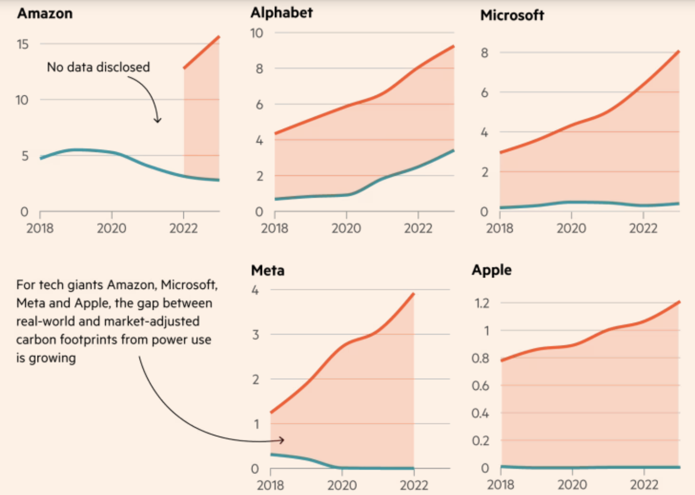

---
theme:
  override:
    palette:
      classes:
        source:
          foreground: "AAAAAA"
        section-title:
          background: "264F4F"
          foreground: "4DEDED"
---

<!-- jump_to_middle -->

<!-- new_lines: 2 -->
<!-- alignment: center -->
Pascal Le Merrer

<!-- end_slide -->

Disclaimer
===

<!-- jump_to_middle -->
<!-- alignment: center -->
À charge, et c'est assumé

<!-- end_slide -->

<!-- jump_to_middle -->
  1. Impact environnemental  
===

<!-- end_slide -->

Le discours des géants du cloud
===

<!-- incremental_lists: true -->
* Amazon : "neutre en carbone d'ici 2040"
* Google : "neutre en carbone depuis 2007"
* Microsoft : "carbone négatif en 2030"

  Bientôt la loi européenne va leur interdire ce genre d'affirmations

<!-- end_slide -->

Des objectifs non tenus
===

<!-- incremental_lists: true -->
* Microsoft +30% de 2020 à 2023
* Google +48% depuis 2019

<!-- speaker_note: |
  Dans leurs rapport environnentaux, les GAFAM avoouent ne pas avoir tenus leurs objectifs de réduction de CO2 en grande partie à cause des IA génératives
-->

<!-- end_slide -->

Ce qu'on trouve dans leurs rapports
===

Source : Financial Times

<!-- speaker_note: |
  https://www.ft.com/content/2d6fc319-2165-42fb-8de1-0edf1d765be3
  Le Financial Times a épluché les rapports sur la "durabilité" des cloud providers,
  et a conclu que les chiffres sur lesquels ils communiquent sont ceux représentés en bleu
  tandis que leurs émissions déclarées sont représentées en rouge
  En bleu c'est la valeur compensée par des crédit carbone, c'est à dire des investisssements dans des énergies renouvelables, en rouge c'est celle qui correspondent au mix énergétique de l'endroit où sont situés les datacenters.

  Les courbes s'arrêtent à 2022 ou 2023, ça a augmenté encore plus depuis

  in 2022, Google operated its data center in Finland on 97% carbon-free energy; that number drops to 4–18% for its data centers in Asia
https://hbr.org/2024/07/the-uneven-distribution-of-ais-environmental-impacts

-->

<!-- end_slide -->

La réalité
===

Les GAFAM émettent 8 fois plus que ce qu'ils avouent

Source : The Guardian, septembre 2024

<!-- speaker_note: |
  le Guardian confirme ce que dit le FT
  les émissions des Gafam seraient 8 fois plus élevées que ce qu'ils disent
  parce qu'ils achètent de l'énergie verte loin des endroits où sont implantés leur datacenters, qui consomment de l'énergie fossile.

https://www.theguardian.com/technology/2024/sep/15/data-center-gas-emissions-tech
-->

<!-- end_slide -->

Et ça ne va pas s'arranger
===

* Triplement des émissions CO2 d'ici 2030
<!-- pause -->
* == 40% des émissions annuelles des USA d'ici 2030

<!-- pause -->
Source : Morgan Stanley

<!-- speaker_note: |
  Les émissions de CO2 des datacenters vont tripler d'ici 2030 à cause de l'IA Générative
  Emissions CO2 de l'IA d'ici 2030 == 40% des émissions annuelles des USA

  le rapport n'est pas dispo en ligne, il a été fourni directement à des clients en septembre 2024
  Par contre il a été repris par des dizaines de sites web

  600 millions de tonnes de CO2 au lieu de 200 sans IA

  Les USA sont le second pays le plus émetteur https://fr.wikipedia.org/wiki/Liste_des_pays_par_%C3%A9missions_de_dioxyde_de_carbone_li%C3%A9es_%C3%A0_l%27%C3%A9nergie

  Generative AI's power demands could skyrocket 70% annually, and by 2027, it may use as much energy as all of Spain needed in 2022
  https://www.morganstanley.com/ideas/sustainability-industry-trends-energy-transition-AI
-->

<!-- end_slide -->

Consommation d'eau
===

<!-- incremental_lists: true -->
* 20 à 50 questions à ChatGPT consomment 0,5 L d'eau
* l'entraînement de GPT-3 aurait consommé 700 000 litres d’eau
* entre 3,8 et 19 millions de litres d’eau par jour / datacenter
* consommation d'eau de l'IA > celle du Danemark en 2027

Sources : Basta! citant le Washington Post
et Pengfei Li et al., “Making AI Less ‘Thirsty’: Uncovering and Addressing the Secret Water Footprint of AI Models”, arXiv, 6 avril 2023.

<!-- speaker_note: |
  ça peut paraitre peu, mais quand OpenAI annonce plus de 100 Millions d'utilisateurs par jour, ce n'est pas négligeable
  sources :
  https://basta.media/comment-intelligence-artificielle-IA-data-centers-gafam-s-accaparent-eau
  
-->
<!-- end_slide -->

Localisation des datacenters
===

L'eau utilisée par les datacenters provient : 

<!-- incremental_lists: true -->
* à **42%** de zones en stress hydrique (Microsoft)
* à **15%** de zones en **forte pénurie** (Google)

Sources : Source Material et The Guardian

<!-- speaker_note: |
  Amazon ne donne pas de chiffres...
  
  En Europe c'est en Espagne qu'ils installent leurs plus gros Datacenters alors qu'une pénurie d'eau frappe le pays
  Microsoft a annoncé fin 2024 un investissement de 2,2 Md d'€ dans La région d'Aragon, au nord de l'Espagne, et Amazon 15 Md. Amazon y a déjà 3 datacenter géants.
  La consommation d'eau annuelle de ces 6 datacenters représentera l'équivalent de 200 piscines olympiques rien que pour le refroidissement (on ne parle pas de l'eau utilisée pour la production d'énergie)  
  Les trois nouveaux datacenter Amazon vont consommer plus d'électricité que toute la région à l'heure actuelle.

  La construction dans des zones sèches est délibérée. Elle évite l'oxydation du matériel.
-->
<!--
Sources: 
https://www.novethic.fr/environnement/climat/avec-leurs-datacenters-amazon-microsoft-et-google-saccaparent-leau-des-regions-les-plus-seches-du-monde
  https://www.source-material.org/amazon-microsoft-google-trump-data-centres-water-use/
  https://www.theguardian.com/environment/2025/apr/09/big-tech-datacentres-water
  -->

<!-- end_slide -->

Matériel
===

<!-- incremental_lists: true -->
* datacenters
* GPU

<!-- speaker_note: |

   Elon Musk a communiqué le 2 Septembre 2024 sur la mise en oeuvre de 100 000 GPU
   dans un nouveau datacenter xAI (donc destiné à faire tourner Grok)
   En décembre ce nombre est passé à 200 000
   Sources : https://x.com/elonmusk/status/1830650370336473253
             https://www.nextbigfuture.com/2025/02/building-the-1-2-gigawatt-xai-data-center-in-2025.html
-->

<!-- end_slide -->
<!-- jump_to_middle -->

  2. Impact sur le web ouvert  
===

<!-- end_slide -->

DDOS
===

Interruptions de service à cause des scrapers

<!-- speaker_note: |
  Le 17 mars 2025 Drew Devault a publié un article intitulé "Please stop externalsing you costs to my face"

  Il passe entre 20 et 100% de son temps à gérer des interruptions de service
  provoqués par les crawler des IA, qui ignore les robots.txt et les instructions nofollow et font des requêtes très coûteuses,
  et reviennent toutes les 6 heures.

  Et toutes les personnes qui font le même métier que lui sont confrontées au même problème.

  Les bots prennent toutes les connexions disponibles, changent de user agent, utilisent des adresses IP variées et changeantes, de façon à ce qu'il soit impossible de les bloquer

  Des services qui fournissaient du contenu en accès libre le bloquent maintenant à cause des crawlers de l'IA; Ex Internet Archive ne peut plus faire de snapshot de MIT Press
-->

<!-- end_slide -->
Impact sur Wikipedia
===

<!-- incremental_lists: true -->
* +50% de trafic sur Wikimedia Commons depuis janvier 2024
* 65% du trafic coûteux vient de bots

Source : Wikimedia Foundation

<!-- speaker_note: |
Source :   
https://diff.wikimedia.org/2025/04/01/how-cra{wlers-impact-the-operations-of-the-wikimedia-projects/
-->
<!-- end_slide -->

Fausses failles de sécurité
===

* soumises dans le cadre de bug bounties

<!-- end_slide -->

<!-- jump_to_middle -->
  3. Qualité des contenus générés  
===
<!-- end_slide -->

Baisse de qualité des études scientifiques
===

* Augmentation exponentielle des études bidons

Source : The Register

<!-- speaker_note: |
https://www.theregister.com/2025/05/13/ai_junk_science_papers/
-->

<!-- end_slide -->

Slop
===

Sur quoi va-t-on entraîner les modèles dans quelques années ?

<!-- speaker_note: |
  Les contenus générés par IA vont dégrader la qualité des sources disponibles
-->

<!-- end_slide -->

<!-- jump_to_middle -->
  4. IA et développement logiciel  
===
<!-- end_slide -->

Impact sur les connaissances
===

<!-- incremental_lists: true -->
* Notre métier est un métier de la connaissance
* Pas d'acquisition de connaissances

<!-- speaker_note: |
  Demander systématiquement à un collègue plutôt que chercher par soi-même : on ne progresse pas
  Exemple de John Ayre qui a reconstruit seul en 2 semaine un portail web qui avais mis 6 mois à être fait par 7 personnes la première fois
  https://jonayre.uk/blog/2022/10/30/the-real-value-isnt-in-the-code/?utm_source=tldrwebdev
-->

<!-- end_slide -->

Formation des juniors
===

<!-- incremental_lists: true -->
* Expérience requise pour détecter les erreurs
* Problème de formation des juniors

<!-- speaker_note: |
  Alors évidement l'impact environnemental, beaucoup s'en moquent
  Mais avez vous pensé à l'impact sur vous en tant que développeur ?

  Demander systématiquement à un collègue plutôt que chercher par soi-même : on ne progresse pas

  Il faut une longue expérience pour être capable de détecter ce qui ne va pas dans le code proposé
  par une IA ; des juniors qui commenceraient à utiliser l'IA avant d'avoir acquis cette expérience
  ne seront pas capable de détecter les problèmes, et vont donc produire du code avec des failles de sécurité,
  ou qui ne gèrera pas les cas aux limites. On risque d'avoir une génération moins compétente.

-->

<!-- end_slide -->

Et pour vous ?
===

Que va-t-il se passer pour vous dans quelques années ?

<!-- speaker_note: |
  Aujourd'hui ça va, car vous bossez sur une techno que vous connaissez.
  Qu'en sera-t-il quand vous devrez apprendre une nouvelle techno ?
-->

<!-- end_slide -->

Impact sur les performances
===

  Pour 25% d'usage de l'IA pour coder :
<!-- incremental_lists: true -->
  * la productivité augmente de 2.1%
  * Le débit de livraison baisse de 1,5%
  * La stabilité des livraisons chute de 7,2%

DORA Research, Impact of Generative AI in Software Development 

<!-- speaker_note: | 
  L'hypothèse avancée par DORA est que l'usage de l'IA amène à mettre en prod des incréments plus gros
-->

<!-- end_slide -->

L'IA résout le mauvais problème
===

"Le coût majeur du code c'est la lecture et la compréhension, pas l'écriture"

Kent Beck, _tidy first?_

<!-- end_slide -->

Dépendance
===

« Nous ne deviendrons pas des développeurs 10x plus performants grâce à l'IA.
<!-- pause -->
Nous devenons 10 fois plus dépendants de l'IA »

<!-- pause -->
Namanyay “AI is Creating a Generation of Illiterate Programmers”

<!-- speaker_note: |
  Dans un article qui a fait le buzz, Namanyay explique qu'il a remplacé
  la satisfaction d'apprendre par la frustration de ne pas avoir de réponse d'une IA
  au bout de 5 minutes
  Il n'apprend plus rien, il ne lit même plus les messages d'erreur, il se contente de les copier coller
  Si ça ne marche pas, il améliore les infos fournies à l'IA, mais ne cherche plus à comprendre
  Et quand Cursor était hors service, il ne voulait même plus essayer de corriger les erreurs
  Il dit lui même qu'après 12 ans de dev, il est devenu moins bon à cause de l'IA
-->

<!-- end_slide -->

Remplacer le Pair-programming par l'IA
===

<!-- incremental_lists: true -->
* Déconseillé
* Pas les avantages du pair-programming

Thoughtworks Tech Radar #32, Avril 2025

<!-- speaker_note: |
  Thoughtworks : 12500 salariés
  Dans son dernier radar technologique, Thoughtworks met en garde contre le remplacement
  du pair programming par le codage avec une IA : on y perd une grande partie des bénéfice du pair-programming, comme la diffusion des connaissances, la propriété collective du code, la réduction du travail en cours (WIP), et plus généralement rendre l'équipe meilleure.
-->

<!-- end_slide -->

Génération de code
===

<!-- incremental_lists: true -->
* Mise en garde de Thoughtworks
* "review fatigue"
* complaisance

Thoughtworks Tech Radar #32, Avril 2025

<!-- speaker_note: |
* augmentation du volume de code publié (gitclear)
* +15% de PR (Github)
* mais augmentation des corrections, et réduction du refactoring
* l'exemple extrême c'est le vibe coding 
https://www.thoughtworks.com/radar/techniques/complacency-with-ai-generated-code
-->

<!-- end_slide -->

Conséquences de l'usage des IA génératives
===

<!-- incremental_lists: true -->
L'usage de l'IA peut mener à :
* une dépendance excessive
* une diminution de l'esprit critique
* une capacité diminuée à résoudre les problèmes sans IA

Source : Microsoft Research 

<!-- speaker_note: |
https://www.microsoft.com/en-us/research/wp-content/uploads/2025/01/lee_2025_ai_critical_thinking_survey.pdf
-->

<!-- end_slide -->

<!-- jump_to_middle -->
  5. Problèmes éthiques  
===

<!-- end_slide -->
Idéologie
===

* Transhumanisme

<!-- speaker_note: |
  Philosophie de vie qui cherchent à prolonger l’évolution de la vie intelligente au-delà de sa forme et de ses limites humaines actuelles à l'aide de réalité virtuelle, intelligence artificielle, neuro-sciences, réseaux neuronaux, vie artificielle, colonisation interplanétaire...
  Larry Page, Sergei Brin, Jeff Bezos, Elon Musk, Sam Altman, Peter Thiel, Mark Zuckerberg... 

  Projet politique transhumaniste : une technocratie dérégulée où les labos de recherche de la Silicon Valley décident du futur de l’espèce.

  Eugénisme
-->

<!-- end_slide -->

Idéologie
===

* Transhumanisme

* Long-termisme

<!-- speaker_note: |
  Les politiques publiques ne devraient plus remédier aux inégalités sociales et économiques actuelles, mais se concentrer sur nos descendants «posthumains», ces êtres «dont les capacités de base excéderont si radicalement celles des humains contemporains qu’elles ne peuvent être considérées humaines selon nos standards actuels

  Le changement climatique, selon les long-termistes, n’est pas un problème prioritaire
-->

<!-- end_slide -->

Idéologie
===

* Transhumanisme

* Long-termisme

* Altruisme efficace

Les prophètes de l'IA, Thibault Prévost
<!-- speaker_note: |
  Gagner beaucoup d'argent, peu importe comment, permet de faire le bien en distribuant 10% de ses gains à des ONG identifiées comme "efficaces". Cela permet de travestir la finance spéculative et les énergies fossiles en oeuvres de bienfaisance.

  Portée par une association nommée "80000 hours", dont le dirigeant en 2015 était Sam Altman.
  On trouve des EA au CA d'OpenAI. Le PDG de Deepmind est un adepte, et recrute régulièrement des EA. Le dirigeant d'Anthropic a des liens forts avec ce mouvement.

-->

<!-- end_slide -->

Propriété intellectuelle
===

<!-- incremental_lists: true -->
* Pillage systématique
* Mais n'hésitent pas à attaquer les autres
* Quel avenir pour l'open source ?

<!-- speaker_note: |
  <!-- Deux poids deux mesures : une mère de famille condamnée à 1,5 M$ d'amende pour avoir téléchargé 24 chanson
  Aaron Swartz, menacé de 35 ans de prison et d'un million de $ d'amende, pour le téléchargement de 70 Go de journaux académiques, s'est suicidé
  Sci-Hub et Zlibrary font l'objet de poursuites judiciaires (par Elsevier notamment) alors qu'ils mettent à disposition des articles scientifiques,
  des textes universitaires et des livres d'intérêt général.
  Tandis que Facebook a entrainé ses LLM sur 80 To de livres piratés et OpenAI a piraté les contenus de O'Reilly

  Dans le sens inverse OpenAI n'hésite pas à accuser DeepSeek de vol de propriété intellectuelle,
  ce qui est particulièrement gonflé

  Aucun respect des licences open source 
-->

<!-- end_slide -->

Solution au changement climatique
===

<!-- incremental_lists: true -->
* IA ==> solutions au changement climatique (Microsoft)
* Holly Alpine, lanceuse d'alerte
* Deal ExxonMobil + 50 000 barils / jour

Source : The Atlantic

<!-- speaker_note: |
https://www.theatlantic.com/newsletters/archive/2024/09/microsoft-is-luring-fossil-fuel-companies-with-ai/679881/
-->

<!-- end_slide -->

Intelligence Artificielle Générale
===

<!-- incremental_lists: true -->
* ~ un programme qui raisonnerait comme un humain
* le Saint-Graal pour les créateurs d'IA
* présenté comme imminent à chaque progrès significatif en IA
* Sam Altman a annoncé un coût de 5000 à 7000 Milliards 
* Demande de régulation de la part de Sam Altman

<!-- speaker_note: |
  La faisabilité d'une AGI est très hypothétique
  Elle est annoncée pour dans 5 ans par certains, tandis qu'autres la juge impossible
  (comme Luc Julia)
  La réalité c'est qu'on en est loin, et que si certains Sam Altman la présentent comme
  imminente, c'est pour attirer les investisseurs, et/ou justifier les investissement colossaux
  qui ont été déjà faits
  Mais aussi leurrer les politiciens de façon à ce qu'ils fassent sauter toute régulation
  https://www.404media.co/republicans-try-to-cram-ban-on-ai-regulation-into-budget-reconciliation-bill/
-->
<!-- end_slide -->

Bulle financière
===

<!-- incremental_lists: true -->
* Le monde de la finance s'interroge
* Beaucoup de similitudes avec la bulle Internet

<!-- speaker_note: |
  Euphorie collective
  Promesses de révolution technologique
  Sous-estimation des risques
  Valorisations excessives (OpenAI : 300 milliards)
-->

<!-- end_slide -->

Société de surveillance
===

« Un vaste système de surveillance piloté par l'IA peut amener les citoyens à un meilleur comportement »

<!-- pause -->
Larry Ellison

<!-- speaker_note: |
  PDG d'oracle
  2ème homme le plus riche du monde
  Au commandes du projet Stargate
  Ferveur défenseur du transhumansime
-->

<!-- end_slide -->

Data workers
===

<!-- incremental_lists: true -->
* L'entrainement est en grande partie manuel
* 150 à 430 millions de data workers en 2023

Estimation de la banque mondiale
<!-- speaker_note: |
Google estime à près d'un milliard, potentiellement, dans les années à venir, le nombre de data workers, d'annotateurs de la donnée, nécessaires pour faire fonctionner ces IA.
-->

<!-- end_slide -->

Exploitation des data workers
===

<!-- incremental_lists: true -->
* pays pauvres
* mal payés
* travail pénible
* visionnage de contenus atroces
* NDA
* virés si syndication

Les sacrifiés de l'IA, en replay sur France TV
<!-- speaker_note: |
  - salaire volontairement bas, ne leur permettant pas de sortir de la pauvreté, alors que les employeurs ont largement les moyens de les payer mieux - et qu'ils payent les développeurs une fortune
  - ex : regarder des heures de vidéo d'un conducteur pour détecter ses moments d'inattention -> 10h00/jour, 6 jours par semaine, pour 10$/jour 
  - soumis à des contenus atroces
  - ex : des viols d'enfants, meurtres et autres contenus du dark web : requis pour entrainer les IA à détecter ce qu'il ne faut pas faire
  - les salariés soumis à ce genre de contenu souffrent de stress post traumatique
  - un salarié explique qu'il a demandé à bénéficier de séances de psy, l'employeur a refusé car cela ferait baisser la productivité
  - un salarié a craqué et tué sa famille
  - NDA prévoit 10 ans de prison en cas de non respect
-->

<!-- end_slide -->

<!-- jump_to_middle -->
  6. Conclusion  
===
<!-- end_slide -->

Récupitualtif
===

<!-- incremental_lists: true -->
* Impact environnemental énorme
* Mise en danger du web ouvert
* Perte de compétences
* Baisse de performance
* Aucun respect de la propriété intellectuelle
* Société de surveillance
* Exploitation des data workers

<!-- speaker_note: |
C'est un nouveau pétrole :
- tout le monde se rue sur l'IA, peu se posent des questions
- les sociétés qui sont derrière n'ont aucuns scrupules, et n'hésitent pas à désinformer
(ex : promesses sur les AGI, il faut bien justifier des investissements énormes)
ou à cacher la vérité (les conditions de travail des data workers)
commme les compagnies pétrolières sur le changement climatique au siècle dernier

Allons nous là aussi nous réveiller quand les dégâts seront irreversibles ?
-->

<!-- end_slide -->

J'aurais aussi pu parler...
===

<!-- incremental_lists: true -->
* des problèmes de sécurité

<!-- end_slide -->

L'avenir
===

<!-- incremental_lists: true -->
* Large Concept Models
* Ralentissement des constructions de datacenters
* Klarna embauche à nouveau
* Limiter aux usages vraiment pertinents

<!-- end_slide -->

En savoir plus
===

<!-- incremental_lists: true -->
* Les sacrifiés de l'IA, en replay sur France TV jusqu'au 17/06/2025
* Les prophètes de l'IA, par Thibault Prévost

<!-- end_slide -->
  
Références
===

https://intelligence-artificielle.developpez.com/actu/362747/-Un-vaste-systeme-de-surveillance-pilote-par-l-IA-peut-amener-les-citoyens-a-un-meilleur-comportement-d-apres-Larry-Ellison-qui-suggere-d-adopter-le-modele-chinois-de-surveillance-de-ses-citoyens/

FOSS infrastructure is under attack by AI companies https://thelibre.news/foss-infrastructure-is-under-attack-by-ai-companies/

AI bots are destroying Open Access https://go-to-hellman.blogspot.com/2025/03/ai-bots-are-destroying-open-access.html

AI is Creating a Generation of Illiterate Programmers https://nmn.gl/blog/ai-illiterate-programmers

OpenAI Introduces Software Engineering Benchmark https://www.infoq.com/news/2025/03/openai-swe-benchmark/?
