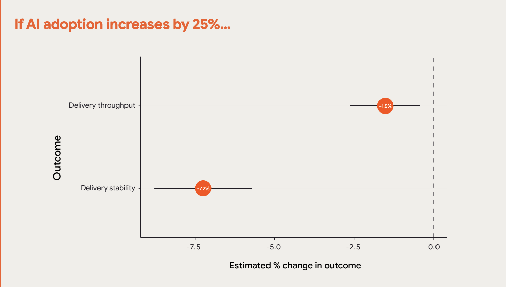

Disclaimer
===

<!-- jump_to_middle -->
A charge, et c'est assumé

<!-- speaker_note: |
  TODO https://academia.hypotheses.org/58766
-->

<!-- end_slide -->
<!-- jump_to_middle -->
Impact environnemental
===

<!-- end_slide -->

Le discours des géants du cloud
===

<!-- incremental_lists: true -->
* Amazon : "neutre en carbone d'ici 2040"
* Google : "neutre en carbone depuis 2007"
* Microsoft : "carbone négatif en 2030"

<!-- speaker_note: |
  Bientôt la loi européenne va leur interdire ce genre d'affirmations
-->

<!-- end_slide -->

Ce qu'on trouve dans leurs rapports
===

Source: Financial Times
https://www.ft.com/content/2d6fc319-2165-42fb-8de1-0edf1d765be3

<!-- speaker_note: |
  Le Financial Times a épluché les rapports sur la "durabilité" des cloud providers,
  et a conclu que les chiffres sur lesquels ils communiquent sont ceux représentés en bleu
  tandis que leurs émissions déclarées sont représentées en rouge
  En bleu c'est la valeur compensée par des crédit carbone, c'est à dire des achats d'énergie
  renouvelables par exemple, mais pas forcément au même endroit que là où ils consomment.

  Les courbes s'arrêtent à 2022 ou 2023, ça a augmenté encore plus depuis

  in 2022, Google operated its data center in Finland on 97% carbon-free energy; that number drops to 4–18% for its data centers in Asia
https://hbr.org/2024/07/the-uneven-distribution-of-ais-environmental-impacts

-->

<!-- end_slide -->

Des objectifs non tenus
===

<!-- incremental_lists: true -->
* Microsoft +30% de 2020 à 2023
* Google +48%  depuis 2019

<!-- speaker_note: |
  Dans leurs rapport environnentaux, les GAFAM avoouent ne pas avoir tenus leurs objectifs de réduction de CO2 en grande partie à cause des IA génératives
-->

<!-- end_slide -->

La réalité
===

Les GAFAM émettent 8 fois plus que ce qu'ils avouent

Source : The Guardian, septembre 2024

<!-- speaker_note: |
  les émissions des Gafam seraient 8 fois plus élevées que ce qu'ils disent

https://www.theguardian.com/technology/2024/sep/15/data-center-gas-emissions-tech
-->

<!-- end_slide -->

Et ça ne va pas s'arranger
===

* Triplement des émissions CO2 d'ici 2030
<!-- pause -->
* == 40% des émissions annuelles des USA d'ici 2030

<!-- pause -->
Source : Morgan Stanley

<!-- speaker_note: |
  Les émissions de CO2 des datacenters vont tripler d'ici 2030 à cause de l'IA Générative
  Emissions CO2 de l'IA d'ici 2030 == 40% des émissions annuelles des USA

  le rapport n'est pas dispo en ligne, il a été fourni directement à des clients en septembre 2024
  Par contre il a été repris par des dizaines de sites web

  600 millions de tonnes de CO2 au lieu de 200 sans IA

  By the end of the decade, the carbon footprint of U.S. data centers will equal roughly 40% of all carbon emitted in the country annually, a new report from Morgan Stanley predicts. 

  Les USA sont le second pays le plus émetteur https://fr.wikipedia.org/wiki/Liste_des_pays_par_%C3%A9missions_de_dioxyde_de_carbone_li%C3%A9es_%C3%A0_l%27%C3%A9nergie

  Generative AI's power demands could skyrocket 70% annually, and by 2027, it may use as much energy as all of Spain needed in 2022
  https://www.morganstanley.com/ideas/sustainability-industry-trends-energy-transition-AI
-->

<!-- end_slide -->

Consommation d'eau
===

* 20 à 50 questions à ChatGPT consomment 0,5 l d'eau
<!-- pause -->
* consommation d'eau de l'IA > celle du Danemark en 2027

<!-- pause -->
Pengfei Li et al., «Making AI Less “Thirsty”: Uncovering and Addressing the Secret Water Footprint of AI Models», arXiv, 6 avril 2023. »

<!-- speaker_note: |
  TODO : minerais...
-->

<!-- end_slide -->
<!-- jump_to_middle -->

Impact sur le web ouvert
===

<!-- end_slide -->

DDOS
===

Interruptions de service à cause des scrapers

<!-- speaker_note: |
  Le 17 mars 2025 Drew Devault a publié un article intitulé "Please stop externalsing you costs to my face"

  Il passe entre 20 et 100% de son temps à gérer des interruptions de service
  provoqués par les crawler des IA, qui ignores les robots.txt et les instructions nofollow et font des requêtes très coûteuses,
  et reviennent toutes les 6 heures.

  Et toutes les personnes qui font le même métier que lui sont confrontées au même problème.

  Les bots prennent toutes les connexions disponibles, changent de user agent, utilisent des adresses IP variées et changeantes, de façon à ce qu'il soit impossible de les bloquer

  Des services qui fournissaient du contenu en accès libre le bloquent maintenant à cause des crawlers de l'IA; Ex Internet Archive ne peut plus faire de snapshot de MIT Press
-->

<!-- end_slide -->
<!-- jump_to_middle -->
IA et développement logiciel
===
<!-- end_slide -->

Pair-programming avec une IA
===

<!-- incremental_lists: true -->
* Déconseillé
* Pas les avantages du pair-programming

Thoughtworks Tech Radar #31, Octobre 2024

<!-- speaker_note: |
  Dans son dernier radar technologique, Thoughtworks met en garde contre le remplacement
  du pair programming par le codage avec une IA : on y perd une grande partie des bénéfice du pair-programming, comme la diffusion des connaissances, la propriété collective du code, la réduction du travail en cours (WIP), et plus généralement rendre l'équipe meilleure.
-->

<!-- end_slide -->

Impact sur les connaissances
===

<!-- incremental_lists: true -->
* Notre métier est un métier de la connaissance
* Pas d'acquisition de connaissances

<!-- speaker_note: |
  Demander systématiquement à un collègue plutôt que chercher par soi-même : on ne progresse pas
-->

<!-- end_slide -->

Formation des juniors
===

<!-- incremental_lists: true -->
* Expérience requise pour détecter les erreurs
* Problème de formation des juniors

<!-- speaker_note: |
  Alors évidement l'impact environnemental, beaucoup s'en moquent
  Mais avez vous pensé à l'impact sur vous en tant que développeur ?

  Demander systématiquement à un collègue plutôt que chercher par soi-même : on ne progresse pas

  Il faut une longue expérience pour être capable de détecter ce qui ne va pas dans le code proposé
  par une IA ; des juniors qui commenceraient à utiliser l'IA avant d'avoir acquis cette expérience
  ne seront pas capable de détecter les problèmes, et vont donc produire du code avec des failles de sécurité,
  ou qui ne gèrera pas les cas aux limites. On risque d'avoir une génération moins compétente.

-->

<!-- end_slide -->

Et pour vous ?
===

Que va-t-il se passer pour vous dans quelques années ?

<!-- speaker_note: |
  Aujourd'hui ça va, car vous bossez sur une techno que vous connaissez.
  Qu'en sera-t-il quand vous devrez apprendre une nouvelle techno ?
-->

<!-- end_slide -->

Impact sur les performances
===

<!-- speaker_note: | 
  Pour 25% d'usage de l'IA pour coder :
  * la productivité augmente seulement de 2.1%
  * Le débit de livraison baisse de 1,5%
  * La stabilité des livraisons chute de 7,2%

  L'hypthèse avancée par DORA est que l'usage de l'IA amène à mettre en prod des incréments plus gros
-->

DORA Research, Impact of Generative AI in Software Development 

<!-- end_slide -->

Dépendance
===

« Nous ne deviendrons pas des développeurs 10x plus performants grâce à l'IA.
<!-- pause -->
Nous devenons 10 fois plus dépendants de l'IA»

<!-- pause -->
Namanyay "AI is Creating a Generation of Illiterate Programmers"

<!-- speaker_note: |
  Dans un article qui a fait le buzz, Namanway explique qu'il a remplacé
  la satisfaction d'apprendre par la frustration de ne pas avoir de réponse d'une IA
  au bout de 5 minutes
  Il n'apprend plus rien, il ne lit même plus les messages d'erreur, il se contente de les copier coller
  SI ça ne marche pas, il améliore les infos fournies à l'IA, mais ne cherche plus à comprendre
  Et quand cursor est hors service, il ne voulait même plus essayer de corriger les erreurs
  Il dit lui même qu'après 12 ans de dev, il est devenu moins bon à cause de l'IA
-->

<!-- end_slide -->

Conséquences de l'usage des IA génératives
===

<!-- incremental_lists: true -->
L'usage de l'IA peut mener à :
* une dépendance excessive
* une diminution de l'esprit critique
* une capacité diminuée à résoudre les problèmes sans IA

Source: Microsoft Research
https://www.microsoft.com/en-us/research/wp-content/uploads/2025/01/lee_2025_ai_critical_thinking_survey.pdf

<!-- end_slide -->

<!-- jump_to_middle -->
Qualité des contenus générés
===
<!-- end_slide -->

Mais ça marche !
===

* SWE-Lancer benchmark : réalisation de tâches pour freelances
* 26.2% de succès

Source : OpenAI
https://www.infoq.com/news/2025/03/openai-swe-benchmark/?

<!-- speaker_note: 
OpenAI a publié en février 2025 un benchmark qui évalue la capacité d'un modèle à réaliser des tâches proposées à des freelances. Le meilleur modèle, Claude 3.5 sonnet, en a résolu 1 quart.

-->

<!-- end_slide -->

Slop
===

Sur quoi va-t-on entraîner les modèles dans quelques années ?

<!-- speaker_note: |
  Les contenus générés par IA vont dégrader la qualité des sources disponibles
-->

<!-- end_slide -->

<!-- jump_to_middle -->
Problèmes éthiques
===

<!-- end_slide -->
Idéologie
===

* Transhumanisme

<!-- speaker_note: |
  Philosophie de vie qui cherchent à prolonger l’évolution de la vie intelligente au-delà de sa forme et de ses limites humaines actuelles à l'aide de réalité virtuelle, intelligence artificielle, neuro-sciences, réseaux neuronaux, vie artificielle, colonisation interplanétaire...
  Larry Page, Sergei Brin, Jeff Bezos, Elon Musk, Sam Altman, Peter Thiel, Mark Zuckerberg... 

  Projet politique transhumaniste: une technocratie dérégulée où les labos de recherche de la Silicon Valley décident du futur de l’espèce.

  Eugénisme
-->

<!-- end_slide -->

Idéologie
===

* Transhumanisme

* Long-termisme

<!-- speaker_note: |
  Les politiques publiques ne devraient plus remédier aux inégalités sociales et économiques actuelles, mais se concentrer sur nos descendants «posthumains», ces êtres «dont les capacités de base excéderont si radicalement celles des humains contemporains qu’elles ne peuvent être considérées humaines selon nos standards actuels

   Le changement climatique, selon les long-termistes, n’est pas un problème prioritairea
-->

<!-- end_slide -->

Idéologie
===

* Transhumanisme

* Long-termisme

* Altruisme efficace

Les prophètes de l'IA, Thibault Prévost
<!-- speaker_note: |
  Gagner beaucoup d'argent, peu importe comment, permet de faire le bien en distribuant 10% de ses gains à des ONG identifiées comme "efficaces". Cela permet de travestir la finance spéculative et les énergies fossiles en oeuvres de bienfaisance.

  Porté par une association nommée "80000 hours", dont le dirigeant en 2015 était Sam Altman.
  On trouve des EA au CA d'OpenAI. Le PDG de Deepmind est un adepte, et recrute régulièrement des EA. Le dirigeant d'Anthropic a des liens forts avec ce mouvement.

-->

<!-- end_slide -->

Propriété intellectuelle
===

<!-- incremental_lists: true -->
* Pillage systématique
* Mais n'hésitent pas à attaquer les autres
* Quel avenir pour l'open source ?

<!-- speaker_note: |
  Deux poids deux mesures : des gens sont allés en prison pour quelques Mo de MP3 téléchargés ou des journaux académiques (Aaron Schwartz)
  Sci-Hub et Zlibrary font l'objet de poursuites judiciaires (par Elsevier notamment) alors qu'ils mettens à disposition des articles scientifiques,
  des textes universitaires et des livres d'intérêt général.
  Tandis que Facebook a entrainé ses LLM sur 80 To de livres piratés et OpenAI a piraté les contenus de O'Reilly

  Dans le sens inverse OpenAI n'hésitee pas à accuser DeepSeek de vol de propriété intellectuelle,
  ce qui est particulièrement gonflé

  Aucun respect des licences open source 
-->

<!-- end_slide -->

Société de surveillance
===

« Un vaste système de surveillance piloté par l'IA peut amener les citoyens à un meilleur comportement »

<!-- pause -->
Larry Ellison

<!-- speaker_note: |
  PDG d'oracle
  2ème homme le plus riche du monde
  Au commandes du projet Stargate
  Ferveur défenseur du transhumansimùe
-->

<!-- end_slide -->

Data workers
===

<!-- incremental_lists: true -->
* L'entrainement est en grande partie manuel
* 100 à 450 millions de data workers

<!-- end_slide -->

Exploitation des data workers
===

<!-- incremental_lists: true -->
* pays pauvres
* mal payés
* travail pénible
* visionnage de contenus atroces
* NDA
* virés si syndication

Les sacrifiés de l'IA, en replay sur France TV
<!-- speaker_note: |
  - salaire volontairement bas, ne leur permet pas de sortir de la pauvreté, alors que les employeurs ont largement les moyens de les payer mieux - et qu'ils payent les développeurs une fortune
  - soumis à des contenus / pratiques atroces
  - ex : regarder des heures de vidéo d'un conducteur pour détecter ses moments d'inattention -> 10h00/jour, 6 jours par semaine, pour 10 € (?)
  - ex : des viols d'enfants, meurtres et autres contenus du dark web : requis pour entrainer les IA à détecter ce qu'il ne faut pas faire
  - les salariés soumis à ce genre de contenu souffrent de stress post traumatique
  - un salarié explique qu'il a demandé à bénéficier de séances de psy, l'employeur a refusé car cela ferait baisser la productivité
  - un salarié a craqué et tué sa famille
-->

<!-- end_slide -->

Conclusion
===

<!-- incremental_lists: true -->
* impact environnemental énorme
* impact sur le web ouvert
* perte de compétences
* baisse de performance
* aucun respect de la propriété intellectuelle
* société de surveillance
* exploitation des data workers

<!-- speaker_note: |
C'est un nouveau pétrole :
- tout le monde se rue sur l'IA, peu se posent des questions
- les société qui sont derrière n'ont aucun scrupules, et n'hésitent pas à désinformer
(ex : promesses sur les AGI, il faut bien justifier des investissement énormes)
ou à cacher la vérité (les conditions de travail des data workers)
commme les compagnies pétrolières sur le changement climatique au siècle dernier

Allons nous là aussi nous réveiller quand les dégâts seront irreversibles ?
-->

<!-- end_slide -->

J'aurais aussi pu parler...
===

<!-- incremental_lists: true -->
* des ressources matérielles requises pour les datacenters
* des problèmes de sécurité
* du culte de l'IA
* de la bulle financière
* de l'arnaque de l'Intelligence Artificielle Générale

<!-- end_slide -->

En savoir plus
===

<!-- incremental_lists: true -->
* Les sacrifiés de l'IA, en replay sur France TV
* Les prophètes de l'IA, par Thibault Prévost

<!-- end_slide -->

Références
===

https://intelligence-artificielle.developpez.com/actu/362747/-Un-vaste-systeme-de-surveillance-pilote-par-l-IA-peut-amener-les-citoyens-a-un-meilleur-comportement-d-apres-Larry-Ellison-qui-suggere-d-adopter-le-modele-chinois-de-surveillance-de-ses-citoyens/

FOSS infrastructure is under attack by AI companies https://thelibre.news/foss-infrastructure-is-under-attack-by-ai-companies/

AI bots are destroying Open Access https://go-to-hellman.blogspot.com/2025/03/ai-bots-are-destroying-open-access.html

AI is Creating a Generation of Illiterate Programmers https://nmn.gl/blog/ai-illiterate-programmers

OpenAI Introduces Software Engineering Benchmark https://www.infoq.com/news/2025/03/openai-swe-benchmark/?
